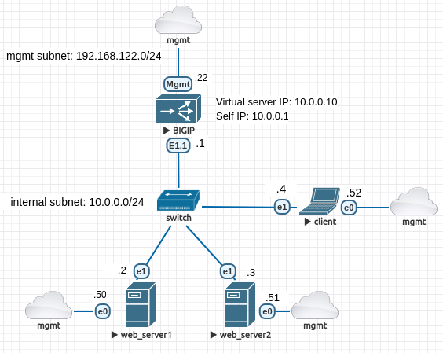

# F5 BIG-IP automation

## Introduction
This repo shows the example of automation of BIG-IP LTM basic configuration for one-armed load-balancing topology. In a one-armed deployment virtual server and pool members are on the same internal vlan/network. See the description of one-armed topology and configuration in these articles:  
https://my.f5.com/manage/s/article/K70671013  
https://my.f5.com/manage/s/article/K54312549

The following network topology simulated in EVE-NG is used in this demo:  



When variable __persistence_enabled__ in configure_load_balancing role is set to ___false___ traffic from the client to web servers is load-balanced in round-robin fashion:
```
[ansible-user@client ~]$ curl 10.0.0.10
Hello World from web_server1
[ansible-user@client ~]$ curl 10.0.0.10
Hello World from web_server2
[ansible-user@client ~]$ curl 10.0.0.10
Hello World from web_server1
[ansible-user@client ~]$ curl 10.0.0.10
Hello World from web_server2
```

When it is set to ___true___ then traffic from one client will be routed always to the same web server from the pool: 
```
[ansible-user@client ~]$ curl 10.0.0.10
Hello World from web_server1
[ansible-user@client ~]$ curl 10.0.0.10
Hello World from web_server1
[ansible-user@client ~]$ curl 10.0.0.10
Hello World from web_server1
[ansible-user@client ~]$ curl 10.0.0.10
Hello World from web_server1
```

## Ansible roles and playbooks
To introduce modularity and reusability for Ansible code it is beneficial to use Ansible Roles. The following roles have been created for this project:
1. **apply_initial_configuration**  
  This role applies the basic configuration for BIG-IP system and network.  
   System:
    - activate license  
    - configure fqdn, DNS, NTP

   Network:
    - configure VLAN and Self IP

2. **configure_load_balancing**  
This role configures BIG-IP to load balance traffic from client to two web servers:
   - configure virtual server and pool with two web servers as pool members
   - configure SNAT
   - configure custom http monitor
   - configure source address persistence profile

3. **deprovision_big_ip**  
Removes BIG-IP configuration added by two previous roles.


Depending on our needs we don't always have to use roles. The following standalone playbooks have been created:
1. __configure_web_servers.yml__  
This playbook configures nginx service on web servers.

2. __reset_big_ip_configuration.yml__  
This playbook entirely erases BIG-IP configuration.

## Remarks  
Notice that __ansible_python_interpreter: "{{ansible_playbook_python}}"__ variable is defined in the inventory. This is required to set the path to correct python interpreter in Execution Environment because __connection: local__ plugin is used. Without it /usr/libexec/platform-python path would be used by default which points to Python 3.6 and some of the libraries in this EE require Python 3.9. Instead using 'connection: local' plugin __delegate_to: localhost__ parameter can be used per task, in this case specyfying python interpreter is not required.  
  
For further explanation how to use Ansible for F5 BIG-IP please check the following F5 website:  
[F5 BIG-IP Ansible documentation](https://clouddocs.f5.com/products/orchestration/ansible/devel/overview.html)

## Feedback
Feedback is always welcome! If you have any comments, please reach me out

## Author

[@mzdyb](https://www.linkedin.com/in/michal-zdyb-9aa4046/)
